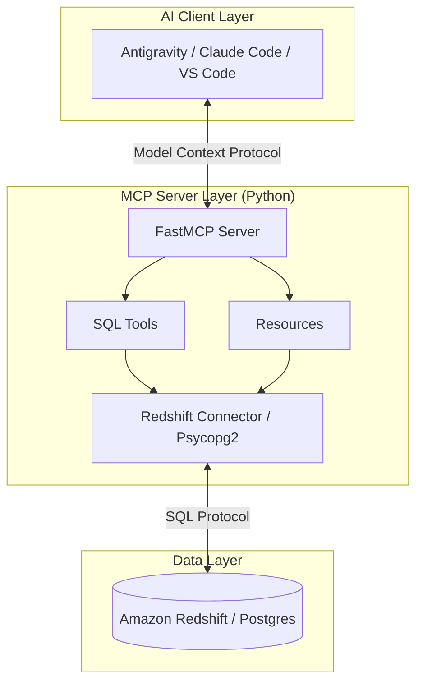
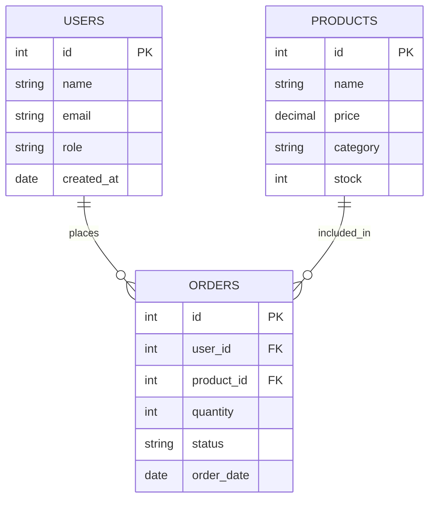

# Redshift MCP Server Design

## System Architecture

```mermaid
graph TD
    subgraph "AI Client Layer"
        A[Antigravity / Claude Code / VS Code]
    end

    subgraph "MCP Server Layer (Python)"
        B[FastMCP Server]
        C[SQL Tools]
        D[Resources]
        E[Redshift Connector / Psycopg2]
    end

    subgraph "Data Layer"
        F[(Amazon Redshift / Postgres)]
    end

    A <-->|Model Context Protocol| B
    B --> C
    B --> D
    C --> E
    D --> E
    E <-->|SQL Protocol| F
```

## Data Model

```mermaid
erDiagram
    USERS {
        int id PK
        string name
        string email
        string role
        date created_at
    }
    PRODUCTS {
        int id PK
        string name
        decimal price
        string category
        int stock
    }
    ORDERS {
        int id PK
        int user_id FK
        int product_id FK
        int quantity
        string status
        date order_date
    }

    USERS ||--o{ ORDERS : places
    PRODUCTS ||--o{ ORDERS : included_in
```
